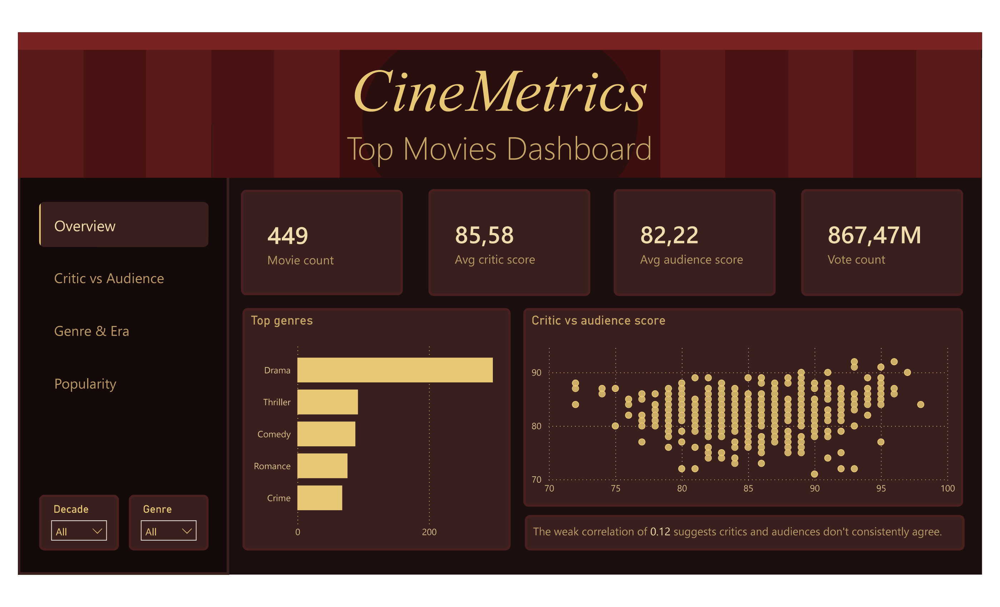
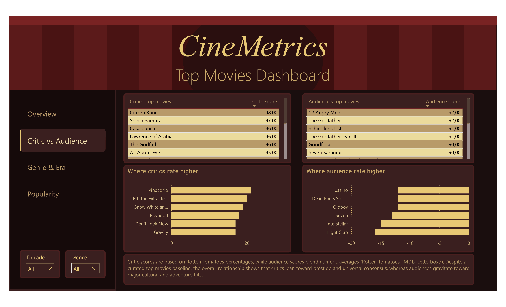
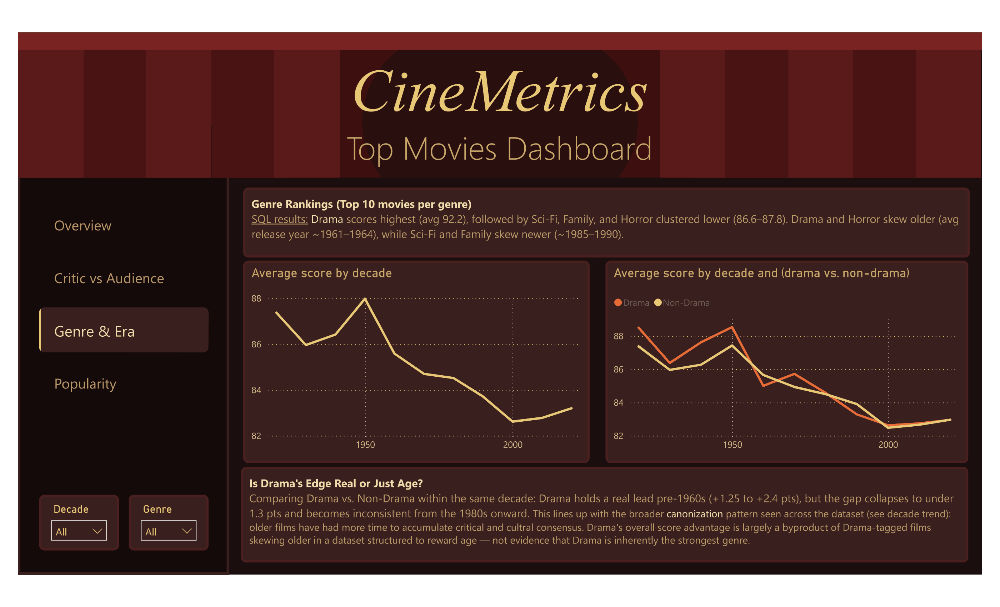
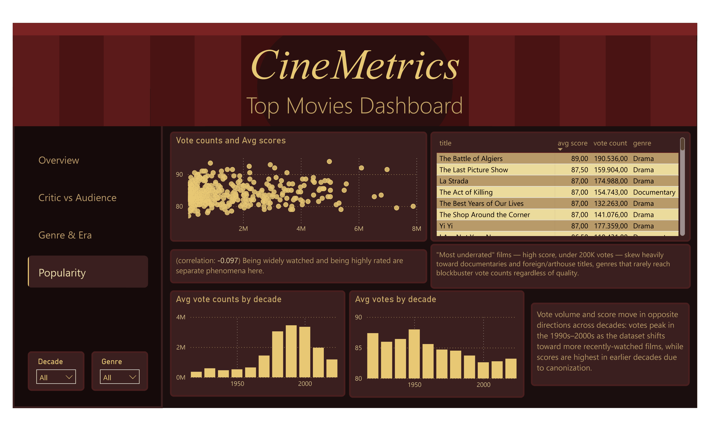

# Power BI Dashboard Notes

This document covers the Power BI dashboard built on top of the SQL analysis described in the main README. It includes an SQL import query, measures and calculated columns, and a page-by-page breakdown of the dashboard.

## Data Import

```sql
SELECT 
    title,
    TRIM(unnest(string_to_array(genre, ','))) AS clean_genre,
    critic_rating_rt,
    weighted_audience_score,
    total_votes
FROM movies;
```

Genres arrive as a comma-separated string, so `unnest` + `TRIM` splits each genre into its own row (a single film can appear in multiple genre rows).

## DAX

- `Decade_year = ROUNDDOWN(movies[year]/10, 0) * 10` — rounds the release year down to its decade.
- `genre_group = IF(CONTAINSSTRING('Query3'[clean_genre], "Drama"), "Drama", "Non-Drama")` — binary grouping used for the Drama vs. Non-Drama comparison.
- Genre-level average critic / average audience measures were created for use across visuals.

## Page: Overview



- KPI cards: movie count, avg critic score, avg audience score, total votes.
- Top genres bar chart (by film count).
- Critic vs. audience scatter plot.

## Page: Critic vs Audience



- Critics' top 10 / Audience's top 10 tables.
- "Where critics rate higher" / "Where audience rate higher" diverging bar charts.
- Total_votes added to the genre chart tooltip, sorted by votes.

## Page: Genre & Era



- Overall decade trend line chart (full dataset).
- Drama vs. Non-Drama by decade line chart (using the `genre_group` measure, full dataset — no top-10 filter).

## Page: Popularity



- Total votes (x) vs. total_average_score (y) scatter plot.
- "Most underrated" table (high score, low votes — skews toward documentary/arthouse by genre).
- Average total_votes by decade vs. average total_average_score by decade — two bar charts side by side, showing the diverging trend.
